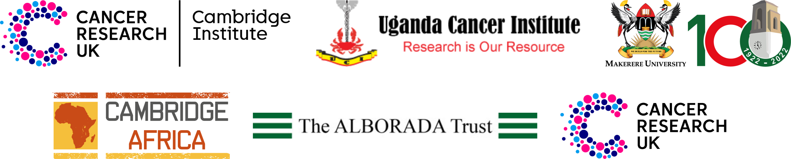

# Cambridge Makerere Summer School 2024
## 4-8th of November 2024 

Welcome to the Cambridge Makerere Summer School 2024! This is the second year of the summer school and we are excited to have you join us. The summer school is a collaboration between the Cancer Research UK Cambridge Institute, the Uganda Cancer Institute and Makere University. The summer school was kindly funded by Cambridge Africa, the Alborada Trust and Cancer Research UK.

The programme will include lectures and practical sessions on:

* Cancer Biology    
* Cancer Immunology    
* Laboratory Techniques for Cancer Research   
* Bioinformatics    
* Career Guidance    
* CV Writing   

## Instructors and lecturers

In Uganda:

* Ashley Sawle (Bioinformatics)   
* Maike de la Roche (Cancer Immunology)   
* Adelyne Chan (Cancer Biology and techniques)  

Online lectures:

* Greg Hannon (Metastasis, spatial analysis, vascular mimicry)     
* Florian Markowetz (Computational tumour biology)    
* Amid Roshan (circulating tumour DNA)    
* Sarah Bohndiek (cancer imaging)     
* James Brenton (ovarian cancer)    

## Programme timetable

### Monday 4th

* 11-12:00am - Lecture: "Introduction into bioinformatics" (Ash) [slides](lecture_slides/BioinformaticsLecture.pdf)
* 12-1pm - lunch  
* 1-3pm - Applied Bioinformatics training: Introduction into R  (Ash) 
* 1-3pm Practical (+ lecture);qRT-PCR (Maike and Adelyne)  
* 3-4pm "Metastasis and vascular mimicry" (Prof Greg Hannon)  
* 4-5pm - Applied Bioinformatics training: Introduction into R (Ash)  
* 4-5pm - Practical: qRT-PCR (Maike and Adelyne)  

### Tuesday 5th

* 11am-12:30pm - Lecture: "Introduction into cancer biology" (Adelyne) [slides](lecture_slides/Introduction_to_Cancer_Biology.pdf)    
* 1-2pm - lunch   
* 2-3pm - Computational tumour biology: "All models are wrong and yours are useless" (Prof Florian Markowetz)   
* 3-6pm - Applied Bioinformatics training: Introduction into R (Ash)   
* 3-6pm - Practical (+ lecture): Flow cytometry (Maike)   

### Wednesday 6th

* 11am-12:30pm - Lecture: "Introduction to cancer immunology" (Maike)   
* 1-2pm - lunch  
* 2-3pm - "Circulating tumour DNA" (Dr Amid Roshan)  
* 3-6pm - Applied Bioinformatics training: Introduction into R (Ash)  
* 6-7pm - Career advice session: CVs, applications, interviews  
* 7-8pm - Personal insights: Angellina, Florence, Gideon, Peter, Segun  

### Thursday 7th

* 11am-12:30pm - Lecture: "Cancer Biology Techniques: WB & ELISA" (Adelyne) [slides](lecture_slides/Western_Blot_and_ELISA.pdf)
* 1-2pm - lunch
* 2-3pm - "Multispectral imaging in early cancer detection" (Prof Sarah Bohndiek)
* 3-6pm - Applied Bioinformatics training: Differential Gene expression analysis with bulk RNASeq data in R" (Ash)
* 3-6pm - Practical: Western blot part 1 (Maike)

### Friday 8th

* 11-12:30 - Lecture: "Cancer immunotherapy” (Maike)
* 1-2pm - lunch
* 2-3pm - "Ovarian cancer" (Prof James Brenton)
* 3-6pm - Applied Bioinformatics training: Differential Gene expression analysis with bulk RNASeq data in R (Ash)
* 3-6pm Practical: Western blot part 2 (Maike)

## Links to the practical course materials

### Laboratory protocols

* [qRT-PCR protocol](protocols/qRT-PCR_protocol.docx)
* [Western blot protocol](protocols/Western_blot_protocol.docx)

### Bioinformatics programme